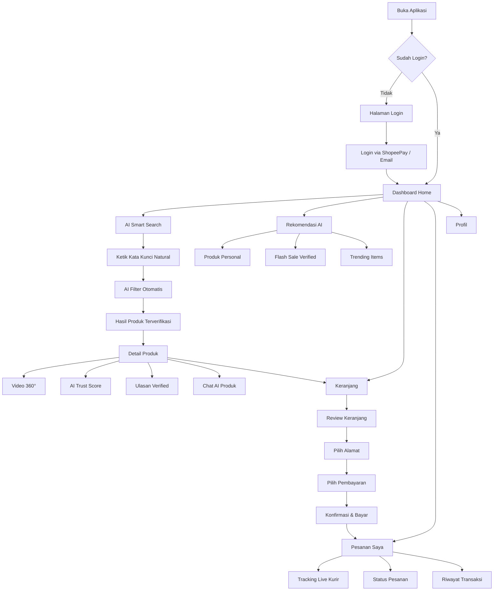
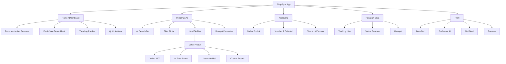
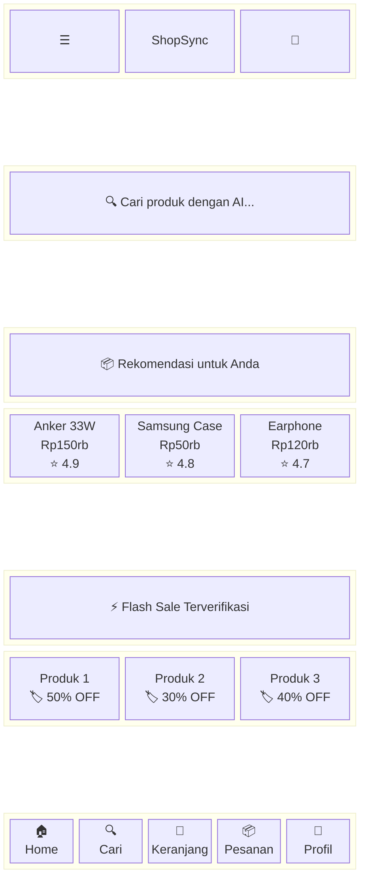
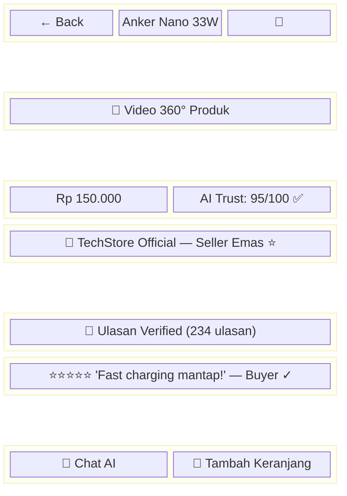
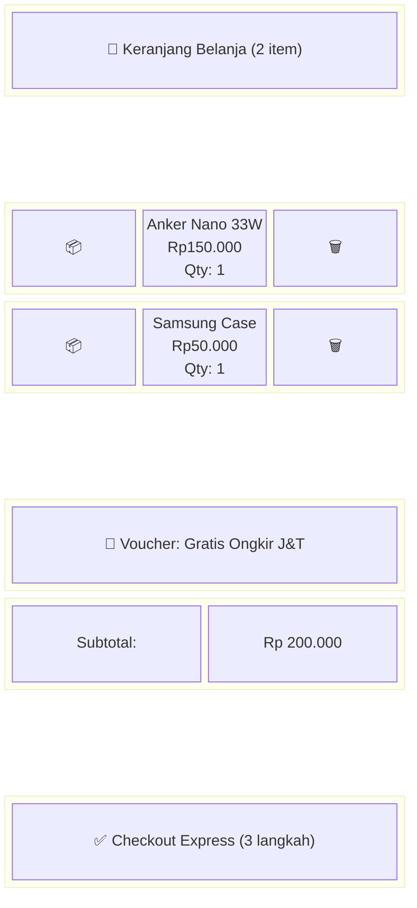
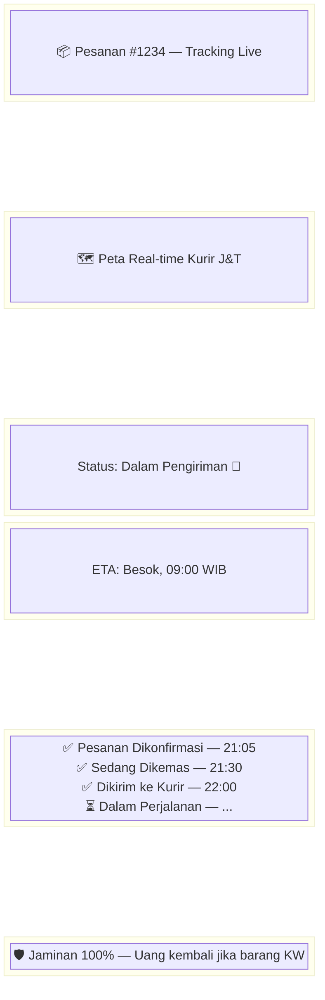
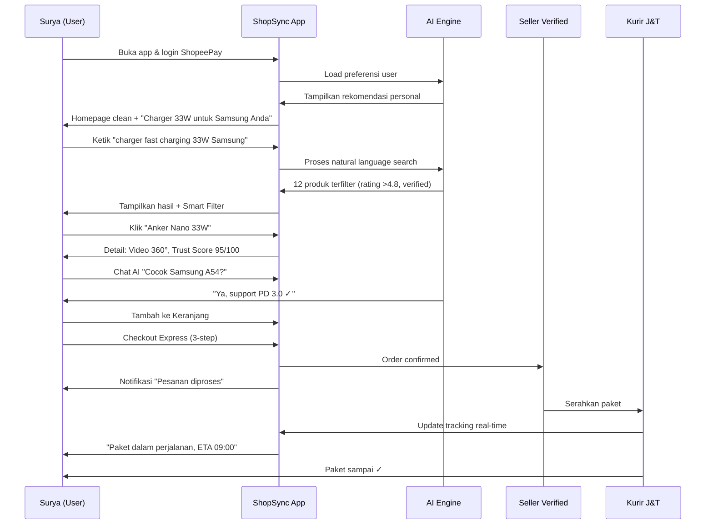

# Sketsa Aplikasi ShopSync — Belanja Pintar
## Mermaid Diagrams

---

## 1. User Flow Diagram — Alur Utama Aplikasi

---

## 2. Sitemap / Information Architecture

---

## 3. Wireframe — Halaman Home (Mobile)

---

## 4. Wireframe — Halaman Detail Produk

---

## 5. Wireframe — Halaman Keranjang & Checkout

---

## 6. Wireframe — Halaman Tracking Pesanan

---

## 7. User Scenario Flow — "Belanja Charger Malam Hari"

