# Sketsa Aplikasi EcoLink Community
## Mermaid Diagrams

---

## 1. User Flow Diagram — Alur Utama Aplikasi

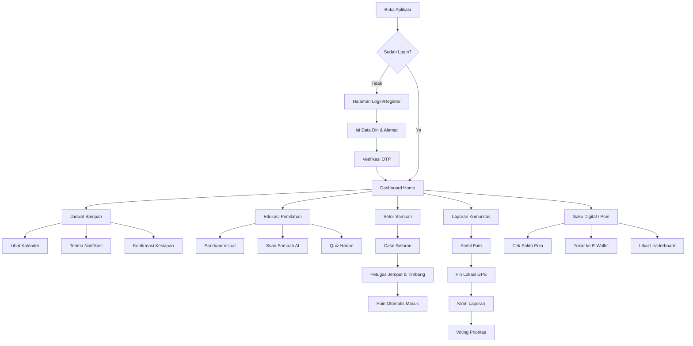

---

## 2. Sitemap / Information Architecture

```mermaid
graph TD
    ROOT[EcoLink Community] --> HOME[Home / Dashboard]
    ROOT --> JADWAL[Jadwal]
    ROOT --> EDUKASI[Edukasi]
    ROOT --> SETOR[Setor Sampah]
    ROOT --> LAPORAN[Laporan]
    ROOT --> POIN[Saku Digital]
    ROOT --> PROFIL[Profil]

    HOME --> HOME1[Ringkasan Poin]
    HOME --> HOME2[Jadwal Terdekat]
    HOME --> HOME3[Tips Hari Ini]
    HOME --> HOME4[Quick Actions]

    JADWAL --> J1[Kalender Bulanan]
    JADWAL --> J2[Detail Jadwal]
    JADWAL --> J3[Request Reschedule]

    EDUKASI --> E1[Panduan Pemilahan]
    EDUKASI --> E2[Scan Sampah]
    EDUKASI --> E3[Quiz & Tips]

    SETOR --> S1[Catat Setoran Baru]
    SETOR --> S2[Riwayat Setoran]
    SETOR --> S3[Statistik Dampak]

    LAPORAN --> L1[Buat Laporan Baru]
    LAPORAN --> L2[Laporan Saya]
    LAPORAN --> L3[Laporan Komunitas]

    POIN --> P1[Saldo & Riwayat]
    POIN --> P2[Tukar Poin]
    POIN --> P3[Leaderboard]

    PROFIL --> PR1[Data Diri]
    PROFIL --> PR2[Pengaturan]
    PROFIL --> PR3[Bantuan]
```

---

## 3. Wireframe — Halaman Dashboard (Mobile)

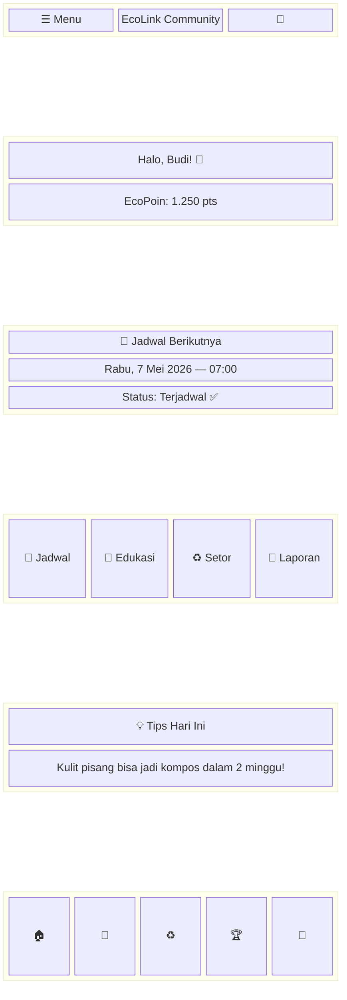

---

## 4. Wireframe — Halaman Jadwal

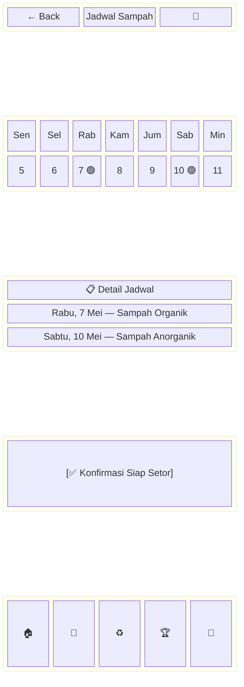

---

## 5. Wireframe — Halaman Edukasi Pemilahan

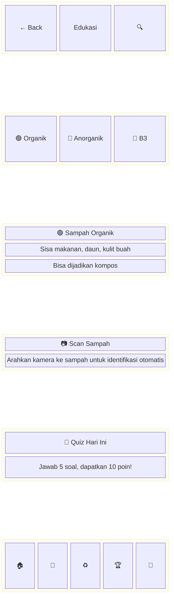

---

## 6. Wireframe — Halaman Setor Sampah

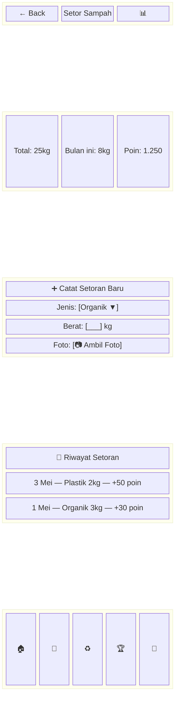

---

## 7. Wireframe — Halaman Saku Digital (Poin)

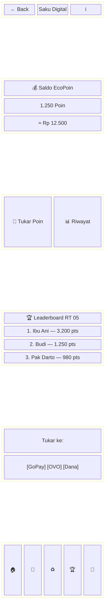

---

## 8. Wireframe — Halaman Laporan Komunitas

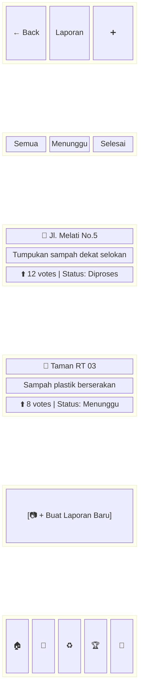

---

## 9. Sequence Diagram — Proses Setor Sampah

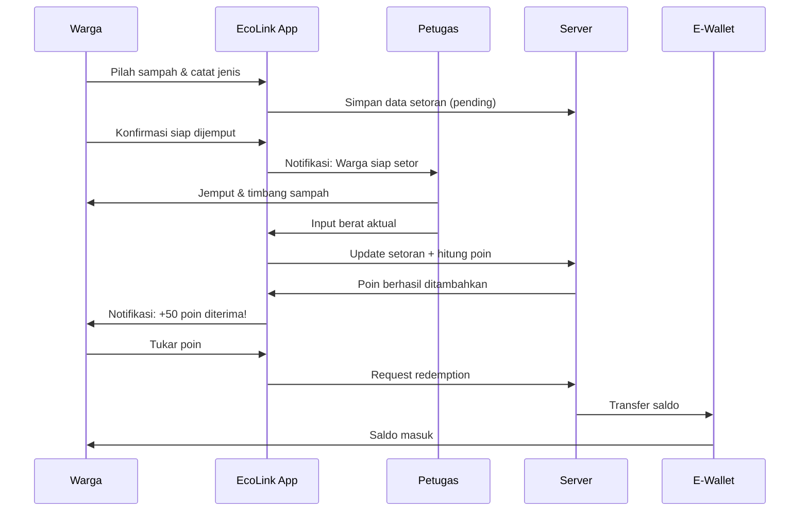

---

## 10. State Diagram — Status Laporan Sampah

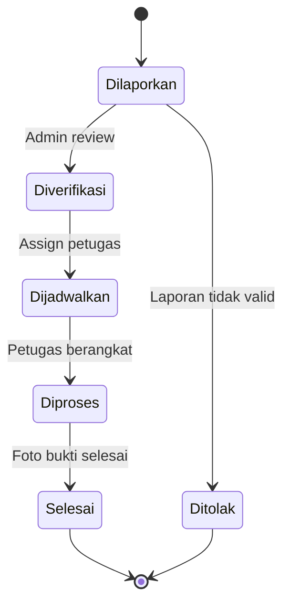

---

## 11. Entity Relationship Diagram

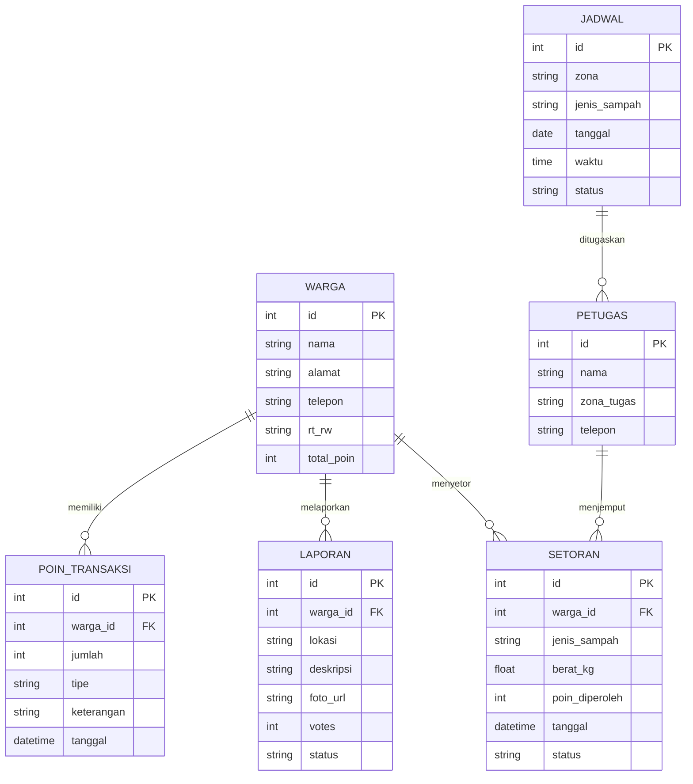

---

## 12. Component Diagram — Arsitektur Sistem

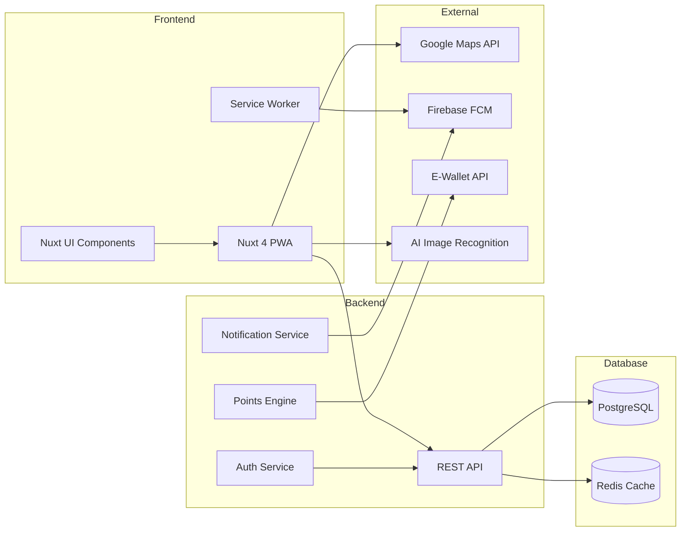

---

*Sketsa dibuat menggunakan Mermaid Diagram — UX Database BINUS 2026*
